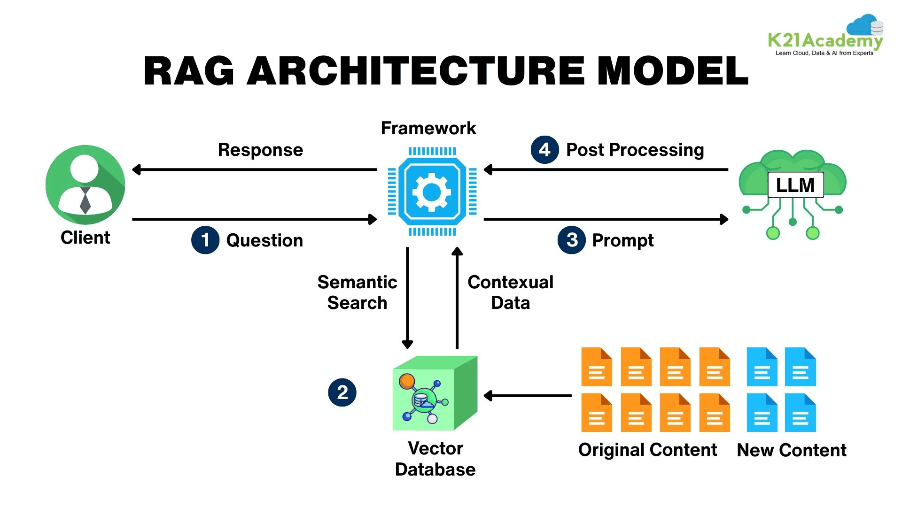
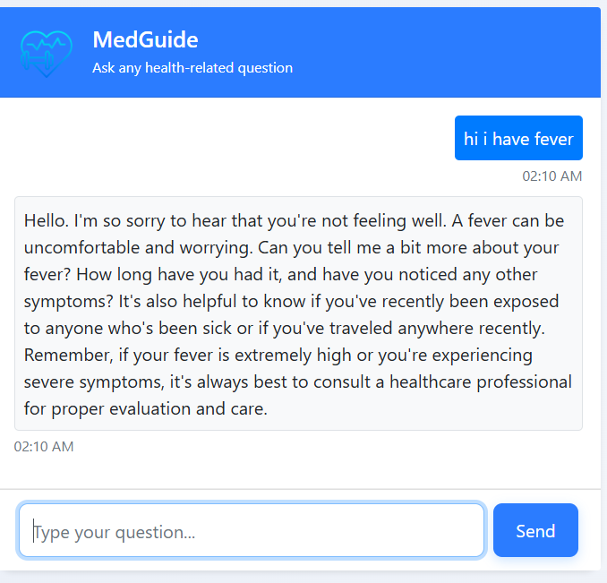

#MEDICAL_CHATBOT — AI-Powered Medical Assistant

A fully functional Medical AI Chatbot built using:

Groq LLaMA 3.1 / 70B (ultra-fast inference)

AstraDB Vector Store (DataStax)

LangChain RAG Pipeline

Flask Web App

Custom chat memory

PDF/Data ingestion + embeddings

This project allows users to ask medical-related questions, and the bot replies using real context from your medical dataset.
Deployed on AWS EC2 with nohup for persistent background running.

IMPORTANT: This chatbot is not a replacement for professional medical care. It is intended to assist clinicians, analysts, and product teams. See the Safety & Compliance section below.
## Table of Contents
>Overview

>Business Problem

>Dataset

>Tools & Technologies

>Project Structure

Research Questions & Key Findings

Project Frontend

How to Run This Project

Deployment Notes (EC2)

Final Recommendations

Safety, Privacy & Compliance

Author & Contact

License


## Overview
Overview

This project builds a medical chatbot that answers clinical and health-related questions by retrieving relevant, source-attributed passages from an internal medical knowledge base (clinical guidelines, drug monographs, institutional SOPs) and combining them with an LLM to produce concise, grounded responses.

Core goals:

Surface trustworthy, cited answers for clinical queries

Reduce clinician search time for protocols, dosing, contraindications

Provide analytics on usage, sources, and model performance
## Business Problem
Clinicians and care teams frequently need rapid access to trustworthy clinical information (guidelines, formularies, policies). Problems this project addresses:

Slow access to up-to-date protocols at point-of-care

Inconsistent answers across staff due to scattered documentation

Need for traceability / source attribution in clinical decision support

Monitoring and improving vendor or content quality (knowledge base curation)
## Dataset / Knowledge Base

Medical PDFs placed under /data/

Automatically chunked and processed

All chunks embedded and stored in AstraDB

Metadata includes:

document name

chunk index

page number

timestamp

This forms the knowledge source for the chatbot.

THE GALE ENCYCLOPEDIA OF MEDICINE 

LINK:https://staibabussalamsula.ac.id/wp-content/uploads/2024/06/The-Gale-Encyclopedia-of-Medicine-3rd-Edition-staibabussalamsula.ac_.id_.pdf


## Tools & Technologies
#Backend & AI

Groq LLaMA 3.1 (70B)

AstraDB Vector Search (DataStax)

LangChain

Python Flask

HuggingFace Embedding Models

#Frontend

HTML

CSS

Bootstrap

Deployment

AWS EC2 (Ubuntu)

nohup

Gunicorn/Nginx (optional)


## Project Structure
# MEDIBOT
```
MEDIBOT/
│
├── README.md
├── .gitignore
├── requirements.txt
├── LICENSE
├── .env                               # Environment variables
│
├── app.py                             # Main Flask/FastAPI application
├── load.py                            # Application loader/initialization
│
├── MEDIBOT/                           # Core application package
│   ├── __init__.py
│   ├── data_converter.py             # Convert documents to processable format
│   ├── ingest.py                     # Document ingestion pipeline
│   └── retrieval_generator.py        # RAG retrieval & generation logic
│
├── DATA/                              # Medical knowledge sources
│   ├── clinical_guidelines/          # PDF/Text clinical guidelines
│   ├── drug_monographs/              # Pharmacology information
│   └── metadata/                      # Document metadata & mappings
│
├── static/                            # Static assets (CSS, JS, images)
│   └── ...
│
└── templates/                         # HTML templates
    └── ...
```
## Data Cleaning & Preparation
Convert PDFs/DOCs to clean text .

Remove PHI / patient identifiers (unless you have proper controls).

Chunk documents by section/paragraph with metadata (title, source, date, section).

Normalize medical terms (optional): map abbreviations and synonyms (SNOMED/ICD mapping if needed).

Handle non-text content (tables/figures) by extracting captions and tables as structured text.

Generate embeddings and persist index (FAISS or remote vector DB) I used AstraDb.
## Research Question and Findings
Research Questions & Key Findings

Examples you may target and store results for:

Which clinical topics generate the most chatbot queries?

How often does the retrieval layer return a direct guideline vs. a generic paragraph?

Which sources are most frequently cited in high-confidence answers?

Is there a measurable improvement in clinician task time when the chatbot is used?

Key sample findings (replace with your results):

Top queried topics: dosing, contraindications, pre-op guidelines

85% of high-confidence responses cite at least one institutional guideline.

Documents older than 3 years were responsible for 12% of retrievals — consider refresh.
## Architecture of RAG


## Frontend


## How to Run This Project
How to Run This Project
1. Clone repository
git clone https://github.com/debangshu9183/MEDICAL__CHATBOT
cd medical-chatbot

2. Create .env (example)
EMBEDDING_PROVIDER=OPENAI
EMBEDDING_API_KEY=sk-...
LLM_PROVIDER=GROQ
LLM_API_KEY=sk-...
VECTOR_STORE_PATH=./data/faiss.index
FLASK_ENV=production

3. Install dependencies (local / dev)
python -m venv .venv
source .venv/bin/activate
pip install -r requirements.txt

4. Ingest and build the index
python scripts/ingest_documents.py --input_dir data/clinical_guidelines --output_index data/faiss.index
python scripts/build_faiss_index.py --input_dir data/ --output_index data/faiss.index

5. Run the API (Docker Compose)
docker-compose up --build
# or locally
uvicorn api.main:app --host 0.0.0.0 --port 8000

6. Example API call
curl -X POST "http://localhost:8000/query" \
  -H "Content-Type: application/json" \
  -d '{
        "question":"What is the recommended prophylactic dosing for VTE in post-op hip replacement?",
        "patient_context": {"age": 68, "weight_kg": 75, "renal_function": "normal"}
      }'


Example Response:

{
  "answer": "Recommended prophylactic dosing is ... Refer to: 'Hospital VTE Guidelines v3.1', Section 'Orthopedic Surgery'.",
  "sources": [
    {"source_id":"guideline_orthopedics_v3.1","section":"VTE prophylaxis","url":null}
  ],
  "confidence_score": 0.86
}


## Deployment Notes (EC2)
his project can be deployed on a single AWS EC2 instance for development or small production use cases. Below are the recommended configurations and steps tailored for running the Medical Chatbot API + FAISS vector store directly on an EC2 machine.
AWS EC2 Deployment
1. Launch EC2 Instance
bash
# Recommended: Ubuntu 22.04 LTS, t2.medium or larger
# Security Group: Allow inbound on port 5000 (or your chosen port)
2. Connect to Instance
bash
ssh -i your-key.pem ubuntu@your-ec2-public-ip
3. Install Dependencies
bash
sudo apt update && sudo apt upgrade -y
sudo apt install python3-pip python3-venv git -y
4. Clone and Setup
bash
git clone https://github.com/debangshu9183/MEDICAL_CHATBOT.git
cd MEDICAL_CHATBOT
python3 -m venv venv
source venv/bin/activate
pip install -r requirements.txt
5. Configure Environment
bash
nano .env
# Paste your environment variables
# Save with Ctrl+X, Y, Enter
6. Run Ingestion (if needed)
bash
python3 MEDIBOT/ingest.py
7. Start Application with nohup
bash
nohup python3 app.py --host 0.0.0.0 --port 5000 > logs/app.log 2>&1 &
8. Verify Running
bash
# Check process
ps aux | grep app.py

# Monitor logs
tail -f logs/app.log

# Test endpoint
curl http://localhost:5000
9. Access Publicly
Open your browser to: http://your-ec2-public-ip:5000


## LIVE DEPLOYMENT LINK

  http://13.51.237.135:5000  
## Final Recommendations
Maintain a content freshness policy (regular re-ingestion & review of documents).

Implement human-in-the-loop review for low-confidence or high-risk queries.

Add source-attribution and expose the exact guideline paragraph in responses.

Audit logs for queries and responses; keep an approval workflow for new knowledge sources.

Run systematic A/B testing with clinicians to measure time savings and trust.


## Safety, Privacy & Compliance
DO NOT use this chatbot as the sole source for clinical decisions. Important considerations:

Disclaimer: Inform users the chatbot is for informational purposes only and not a substitute for professional judgment.

PHI & Data Handling: Remove or properly secure PHI. If your system will process PHI, ensure HIPAA (or local regulations) compliance, BAAs with vendors, encrypted storage, and access controls.

Third-party LLMs: Avoid sending PHI to third-party APIs unless contractual protections are in place. Prefer on-prem or dedicated-hosted models for sensitive deployments.

Clinical validation: Have clinicians validate responses and curate high-risk topics (medication dosing, cancer care, critical care).

Logging & Retention: Keep logs for QA but redact PHI; set retention policies.
## Author & Contact
Aspiring Data Scientist

📧 debangshu.data@gmail.com

🔗 LinkedIn:www.linkedin.com/in/debangshu-sadhukhan-ab5861200
